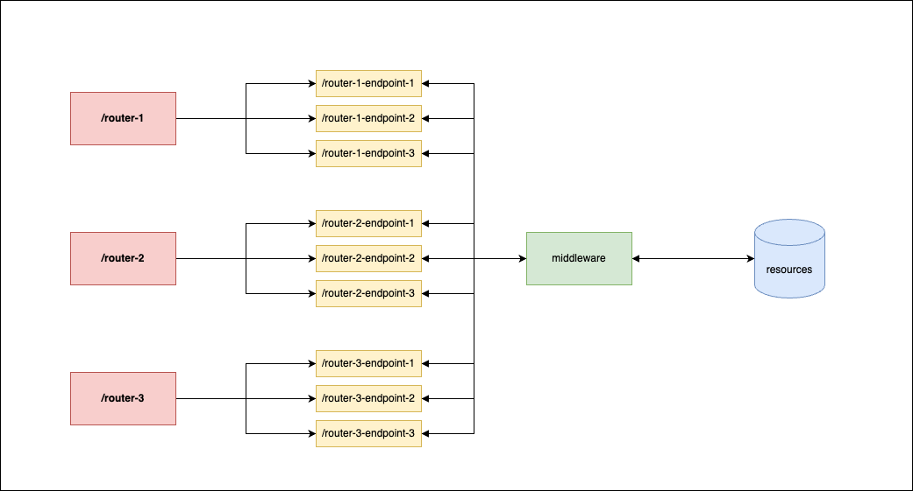

# Mobile Component APIs

The idea is to address the problem listed [here](https://docs.google.com/document/d/15bf9yCOC75mOezL4bCQ6w_elUs14V9DrGU6hFZca6UQ/edit).


## How to run the code.
Code is dockerized, make sure you have docker installed in your system and make sure it is running before proceeding.
* ```docker build -t fanztar-test .```
* ```docker run -d --name fanztar-test-container -p 5002:80 fanztar-test```

## How to verify if it's running?
* Open terminal and run the following command : ```curl -X 'GET' \
  'http://localhost:5002/' \
  -H 'accept: application/json'```

* You should get following message in terminal  : ```{
  "message": "Hello World"
}```

## How this works?
* Directly you can use [swagger docs url](http://localhost:5002/docs)
    * Click the ```POST /orders/``` tab.
    * Click on the ```try it out button``` just at the middle of right edge.
    * Update the request body:
        * From ```{
            "components": [
                "string"
            ]
            }```
        * To Something of your choice or try this one : ```{
            "components": ["I","A","D","F","K"]
            }```
        * Click the execute button and scroll down to see the results.
* You can run any of the following curls to see variation of results.
    * All unique parts.
        * Curl : ```curl -X 'POST' \
            'http://localhost:5002/orders/' \
            -H 'accept: application/json' \
            -H 'Content-Type: application/json' \
            -d '{
            "components": ["I","A","D","F","K"]
            }'```
        * Output : ```{
            "order_id": "a6059358-fba4-46ea-9218-896e60d43917",
            "total": 142.3,
            "parts": [
                "Android OS",
                "LED Screen",
                "Wide-Angle Camera",
                "USB-C Port",
                "Metallic Body"
            ]
            }```
    * Unknown part present.
        * Curl : ```curl -X 'POST' \
            'http://localhost:5002/orders/' \
            -H 'accept: application/json' \
            -H 'Content-Type: application/json' \
            -d '{
            "components": ["I","A","D","F","Z"]
            }'```
        * Output : ```{
            "detail": "Component-Id : Z not found."
            }```

    * Repeated part present.
        * Curl : ```curl -X 'POST' \
            'http://localhost:5002/orders/' \
            -H 'accept: application/json' \
            -H 'Content-Type: application/json' \
            -d '{
            "components": ["I","A","D","F","B"]
            }'```
        * Output : ```{
        "detail": {
            "reason": "part : Screen(2) has more than 1 asked component, please check and make sure you have only one component for each of the following parts : Port, OS, Body, Camera, Screen"
        }
        }```


## Architectural Overview


## Ideas & Assumptions behind the choice.

### Ideas
* Following are the sub-modules of the code:
    * ```middleware``` : This sub-modules deals acts as intermediate point between the request and raw resources.
    * ```resources``` : To store raw-resources of the project.
    * ```routers``` : routers to define set of endpoints.
        ```routers/order``` : contains routers regarding the order related items.
        * Similarly different routers can be defined.
    * ```schemas``` : contains schemas for request-bodies for the requests.

### Assumptions
* Number of parts(screen, os etc) will not grow as fast as the components themselves.
* Details for component-list provided in the test are added to ```resources/constants/CODE_2_PRICE-PART.json``` and assumed to be in this chosen format.
* Some exception handlings are overlooked in light of tight-knit resources.
    * Json Reading in ```middleware/components.py``` can also be improved to handle file-reading.
    * Logging can also be added using LoggingConfig and calling via proper channels.

    